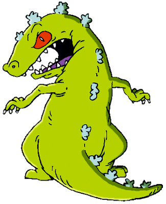

<html>
<head>
<title>W3.CSS Template</title>
<meta charset="UTF-8">
<meta name="viewport" content="width=device-width, initial-scale=1">
<link rel="stylesheet" href="https://www.w3schools.com/w3css/4/w3.css">

</head>
<body>

<!-- Navbar (sit on top) -->

  

    <a href= class="w3-bar-item w3-button">Castillo E-portfolio</a>
    <!-- Right-sided navbar links. Hide them on small screens -->
    

      <a href="https://qjlcastillo.github.io/About-me.github.io/" class="w3-bar-item w3-button">About Me</a>
    

  

<!-- Page content -->

  

  
  <!-- Prelim Section -->
  

      <a href="https://qjlcastillo.github.io/Prelims.github.io/" class="w3-bar-item w3-button">Prelims</a>
      <h4>Contents:</h4>
      
      
      <h4>Activty 1</h4>
      <h4>Activty 2</h4>
      <h4>Activty 3</h4>
      <h4>Activty 4</h4>
         
    

      
    

  

  <!-- Midterm section -->
  

    

      <a href="https://qjlcastillo.github.io/midterms.github.io/" class="w3-bar-item w3-button">Midterms</a>
      
      <h4>Contents:</h4>
      
      
      <h4>Activty 7</h4>
      <h4>Activty 8</h4>
      <h4>Activty 9</h4>
      <h4>Activty 10</h4>
         
    
    

      
    

  

  
  <!-- Final section -->
  

    

      <a href="https://qjlcastillo.github.io/Finals.github.io/" class="w3-bar-item w3-button">Finals</a>
      <h4>Contents:</h4>
      
      
      <h4>Activty 12</h4>
      <h4>Activty 13</h4>
      <h4>Activty 14</h4>
      <h4>Activty 15</h4>
         
    

      
    

  

</body>
</html>

